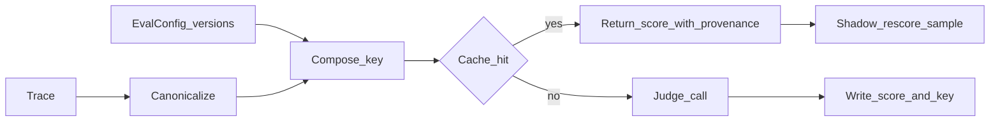
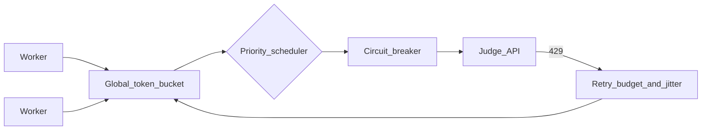
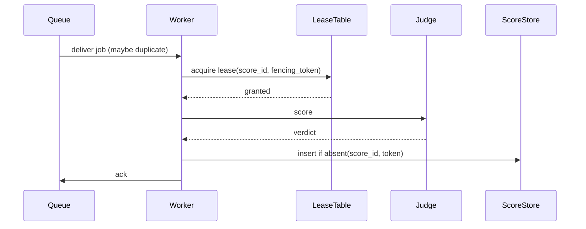
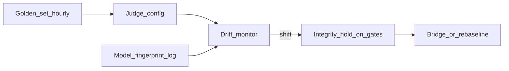
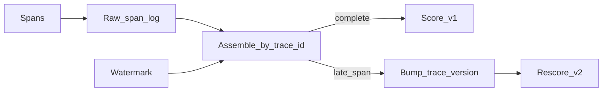
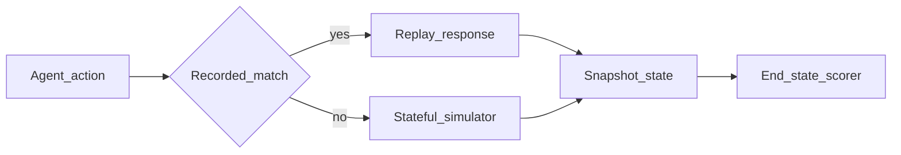
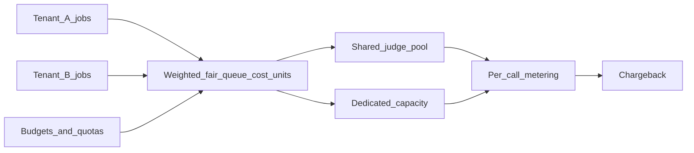

# 02 — System Design Traps (v2)

Ten scenarios from an LLM-as-a-judge evaluation platform that scores large volumes of agent traces. Each has three parts: **Challenge** (what the interviewer asks), **Hidden catch** (what a mid-level design misses), and **Ideal solution**. The solution covers five headings: monitoring and telemetry, data contracts, failure containment, fallback strategy, and recovery path.

Running assumptions: traces come in through a stream. A scheduler fans out scoring jobs on an at-least-once queue to a worker fleet. The workers call hosted or self-hosted judge models and write scores to a score store. Dashboards, launch gates and training pipelines read from that store.

---

## Scenario 1 — Score cache whose key omits the judge or rubric version

**Challenge.** "Judge calls cost $40k a month. Add a cache so identical traces aren't re-scored."

**Hidden catch.** The obvious key is `hash(trace_content)`. When the rubric text, judge model, prompt template, sampling parameters or parser change, the cache keeps serving **stale scores under the new configuration**. The comparison "rubric v3 vs v4" then silently compares v3 with a mixture of v3 and v4. Nothing errors. The dashboards just drift toward "no change." A second catch: a cache shared across tenants leaks information through timing and hit rate, and may break data-residency terms.

**Ideal solution.**
- **Data contract.** The cache key is the full *evaluation identity*:
  `H(trace_canonical_hash, judge_model_snapshot_id, rubric_id@version, prompt_template_hash, sampling_params, parser_version, tenant_id)`.
  - `trace_canonical_hash` is computed on a canonicalised trace: sorted keys, stripped volatile fields such as timestamps and request IDs, and normalised whitespace.
  - Every stored score carries the same fields, so any score can be traced to the exact configuration that produced it.
- **Monitoring.**
  - Hit rate per evaluation config. A new config version with a non-zero hit rate on its first run is a key bug.
  - *Shadow re-scoring*: re-score 0.5% of cache hits live and alert if the disagreement rate exceeds the judge's known test-retest flip rate.
- **Failure containment.** Keep the cache namespaced per tenant. Version bumps create new keyspaces, and old ones expire by TTL rather than by in-place invalidation.
- **Fallback.** If the key cannot be fully computed (missing version metadata), bypass the cache and score live. Never fall back to a partial key.
- **Recovery path.** Because scores carry config provenance, a query finds every score whose config doesn't match its experiment's declared config. Invalidate and re-score those, then mark affected experiment reports "superseded."

---

## Scenario 2 — Rate-limit (429) retry storms across a worker fleet

**Challenge.** "Backfills sometimes take the judge provider down to near-zero goodput for 20 minutes. Workers retry on 429. Fix it."

**Hidden catch.**
- Per-worker retries with fixed or unjittered backoff synchronise across hundreds of workers. When capacity dips, every worker retries in lockstep.
- With 3 immediate retries, offered load can reach **4×** the base rate exactly when capacity is scarce. Goodput collapses: the capacity that exists is spent on requests that will be rejected or time out.
- Per-worker limiters don't compose. 400 workers each at "a safe 5 rps" is 2,000 rps against a 1,500 rps quota.

**Ideal solution.**
- **Global admission control.** Use a central (or sharded) token bucket sized to the provider quota in both requests per minute *and* tokens per minute, with headroom of about 10%. Workers acquire tokens before calling. Queue depth grows instead of 429 rate.
- **Retry discipline.**
  - Exponential backoff with *full jitter*: \(\text{sleep} = U(0, \min(\text{cap}, b \cdot 2^n))\).
  - Honour `Retry-After`.
  - A **retry budget**: fleet-wide retries capped at 10% of successful requests, which bounds amplification at 1.1×.
- **Circuit breaker per provider and model.** Open on a sustained 429 or 5xx rate. While open, only probe traffic passes.
- **Priority classes.** Live launch-gate evaluation > online monitoring > backfill. Backfill is shed first.
- **Monitoring.** Offered vs. admitted vs. successful rps, 429 rate, retry ratio, token-bucket wait time, goodput in tokens scored per second, and breaker state.
- **Data contract.** Each job declares a priority and a deadline. Past-deadline jobs are dropped rather than retried.
- **Fallback.** Fail over to a secondary judge deployment only if it is **the same pinned model snapshot** (for example a self-hosted replica). Never fail over to a different model silently. If none exists, defer rather than degrade.
- **Recovery.** When the breaker closes, a slow-start ramp (like TCP) prevents a thundering herd from the backlog.

---

## Scenario 3 — Stragglers from long-tailed trace lengths

**Challenge.** "An evaluation run over 1M traces finishes 95% in 40 minutes, then takes 3 more hours. Why, and how do you fix it?"

**Hidden catch.**
- Trace lengths are heavy-tailed. The p99.9 agent trace may be 200k tokens with hundreds of tool calls, while the median is 4k. Judge latency and failure probability grow with length, and some traces exceed the judge's context window and fail after many retries.
- Static sharding by trace count puts all-long shards on a few workers.
- Tail amplification: if a run waits on 100 shards and each has a 1% chance of hitting a straggler, \(P(\text{run delayed}) = 1 - 0.99^{100} = 0.63\).

**Ideal solution.**
- **Size-aware scheduling.** Shard by estimated *token cost*, not item count. Dispatch longest-first (LPT) so long items start early.
- **Hierarchical scoring for oversized traces.** Segment the trajectory by step or subtask, score the segments with a step-level rubric, then run a final aggregate judgement over the segment summaries.
  - The data contract must state which rubric dimensions are valid under segmentation. Global coherence, for example, needs a summary pass.
  - Record `scoring_mode = full | segmented` on every score so the two populations are never mixed without a flag.
- **Hedged requests.** For items past the p95 expected latency for their size bucket, issue a duplicate request and take the first result. This is safe only with idempotent writes (Scenario 4).
- **Work stealing.** Idle workers pull from the queues of loaded workers.
- **Monitoring.** Latency per size bucket, completion-curve shape, a per-worker straggler detector, and counts of context-overflow failures.
- **Containment.** A per-item timeout and max-attempts, then a dead-letter queue with the reason. The run completes with an explicit `unscored` count.
- **Fallback.** Reports show coverage (for example "99.7% scored; 0.3% unscored, all > 128k tokens") and must not silently drop the long tail. Long traces are disproportionately failures, so dropping them biases the pass rate upward.
- **Recovery.** Re-drive the dead-letter queue with segmented mode or a long-context judge, and mark those scores with their mode.

---

## Scenario 4 — Exactly-once scoring under at-least-once queues

**Challenge.** "Our aggregate numbers drift by around 0.5% between identical reruns, and billing for judge calls is higher than traces × judges."

**Hidden catch.**
- At-least-once delivery plus worker crashes, visibility timeouts or hedged requests produces duplicate scoring. Appending duplicate score rows double-counts some traces.
- Non-deterministic judges (see traps doc, Trap 4) make duplicates *disagree*, so which one "wins" depends on ordering.
- "Exactly-once delivery" is impossible across a network. What you can build is **exactly-once effect**.

**Ideal solution.**
- **Idempotency key.** `score_id = H(trace_id, trace_version, eval_config_id)`, the same identity as the Scenario 1 cache key minus the tenant salt.
- **Conditional write.** `INSERT ... ON CONFLICT (score_id) DO NOTHING` (first-writer-wins), or a compare-and-set on a version column. Aggregates read only from this deduplicated table.
- **Transactional outbox.** The score write and the "score produced" event go in one transaction. A relay publishes from the outbox, and consumers deduplicate by `score_id`.
- **Cost control.** Before calling the judge, the worker takes a short lease on `score_id` in a lease table (with a fencing token). A second worker that sees an active lease backs off. This bounds duplicate *spend*, not just duplicate rows.
- **Monitoring.**
  - Duplicate-attempt rate: attempts per unique `score_id`.
  - Conflict rate on insert.
  - For observed duplicates, the disagreement rate between them. That is free test-retest measurement.
- **Containment.** A crash between the judge call and the write only wastes a call. The retry produces the same key.
- **Recovery.** A reconciliation job compares expected (trace × config) pairs with present `score_id`s, then re-enqueues missing pairs and reports extras.

---

## Scenario 5 — Backfill racing live evaluation

**Challenge.** "We launched rubric v5 and started backfilling 90 days of traces. Live traffic is scored with v5 too. Some dashboards show v4 scores reappearing for recent traces."

**Hidden catch.**
- The backfill job was started from a config snapshot taken *before* a hotfix, or reads a stale config cache. It writes older-config scores over live ones.
- With last-writer-wins by wall-clock time, whichever job writes last wins, regardless of which config is canonical.
- Backfill also starves live scoring of judge quota (Scenario 2), so live launch gates miss their SLAs.

**Ideal solution.**
- **Data contract.** Scores are keyed by `(trace_id, eval_config_id)` and **never overwritten** across configs. v4 and v5 scores coexist. A separate *pointer table* maps `(metric_name, trace_id)` to the canonical `eval_config_id`, and it is updated atomically when a config is promoted. Readers resolve through the pointer.
- **Fencing.** Backfill jobs carry the config epoch they were launched under. Writes with an epoch older than the currently promoted epoch go to a quarantine partition rather than the canonical view.
- **Capacity isolation.** Separate quota pools, or strict priority with preemption. Backfill runs in off-peak windows with its own budget.
- **Monitoring.**
  - Config-mix per dashboard: the fraction of rows by `eval_config_id`, with an alert on unexpected mixtures.
  - Backfill progress and ETA.
  - Live SLA attainment.
- **Fallback.** If the backfill falls behind, historical views show a coverage band ("v5 available for 62% of the window") rather than silently mixing configurations.
- **Recovery.** Because nothing is overwritten, recovery is a pointer flip plus re-running only the quarantined items.

---

## Scenario 6 — Silent judge-model alias upgrades

**Challenge.** "On Tuesday, judge-rated quality for every agent rose about 3 points at once. No one deployed anything."

**Hidden catch.**
- The judge is referenced by a floating alias (`provider-model-latest`), and the provider rolled a new snapshot. Or the same snapshot moved to new serving hardware, quantisation or safety filters.
- Every historical comparison across Tuesday is now confounded. A uniform shift can also hide non-uniform changes: the judge became more lenient on tool-use traces and stricter on refusals.

**Ideal solution.**
- **Data contract.**
  - Evaluation configs must reference immutable snapshot IDs. Aliases are rejected at config validation.
  - Log the provider's returned model identifier and system fingerprint (where available) on every call, and alert on any value not in the expected set.
- **Canary golden set.** A fixed set of about 500–2,000 human-labelled traces is scored by each production judge config every hour. Monitor:
  - Mean score and the full score distribution (KS test).
  - Agreement with human labels.
  - Per-slice deltas.
  - Test-retest flip rate.
  - Alert when the shift exceeds a threshold calibrated from historical canary noise, for example beyond 4σ of the canary's hour-to-hour SD.
- **Containment.** On alarm, freeze launch gates that depend on the judge ("judge integrity hold") and tag all scores since the last good canary as `suspect`.
- **Fallback.** Use a self-hosted pinned judge replica where the contract allows it. Otherwise keep scoring, but under a new config ID, and bridge the two.
- **Recovery.**
  - Re-score the canary and a stratified sample under both old and new judges to fit a *bridging* calibration (per-slice mapping from new to old scores).
  - Or re-baseline: re-score all comparison arms with the new judge. Comparisons are valid only within one judge snapshot.
  - Document the break in time-series dashboards.

---

## Scenario 7 — Streaming trace ingestion with late and out-of-order events

**Challenge.** "Agents emit spans (LLM calls, tool calls, sub-agent calls) to our collector. We score a trace when it looks complete. Some scores are computed on partial traces."

**Hidden catch.**
- Spans arrive out of order and late: mobile clients batch-upload, long-running tools finish hours later, and collectors retry.
- A "complete" heuristic such as "no spans for 60 s" fires on traces with a long tool call in progress.
- Partial traces look like failures (no final answer), so the pass rate is **biased downward**, and the bias depends on latency. Slower agents look worse for the wrong reason.

**Ideal solution.**
- **Data contract.**
  - Spans carry `trace_id`, `span_id`, `parent_span_id`, event-time timestamps and a sequence number.
  - The agent SDK emits an explicit terminal event (root span end with a status) where possible.
  - A trace is `complete` if the root span has closed and every opened child span has closed, or if a completeness deadline has passed. In the second case the trace is `complete_by_timeout` with a list of missing spans.
- **Event-time processing.**
  - Per-source watermarks with an allowed-lateness window, for example the p99.9 of observed lateness per client type.
  - Sessionisation by `trace_id` rather than wall-clock windows.
- **Versioned re-scoring.** If spans arrive after scoring, bump `trace_version`. The new version is scored with the same idempotency scheme (Scenario 4), and the canonical pointer moves to the latest version.
- **Monitoring.**
  - Lateness distribution per source.
  - Fraction scored as `complete_by_timeout`.
  - Re-score rate caused by late spans.
  - Orphan spans with no root.
  - Pass rate split by completeness state. This detects the bias directly.
- **Containment.** Exclude `complete_by_timeout` traces from launch-gate metrics, or report them separately. Keep a dead-letter store for malformed span trees.
- **Recovery.** Replay from the raw immutable span log, which is the system of record, to rebuild traces after a parser or collector bug.

---

## Scenario 8 — Sandboxed tool environments for replaying agent trajectories

**Challenge.** "We want trajectory-level regression tests: replay last month's agent sessions against a new agent version and score the outcomes. Design the environment."

**Hidden catch.**
- Live replay against real tools causes real side effects (refunds, emails, DB writes) and is non-deterministic: live data changed, time moved, and APIs are rate-limited.
- Recording tool responses and replaying them breaks as soon as the new agent takes a *different* action. There is no recorded response for an action that was never taken. That is exactly the case you want to test (see traps doc, Trap 12).
- Web-browsing agents can reach benchmark answers or exfiltrate data.

**Ideal solution.**
- **Three fidelity tiers:**
  1. **Record-replay** for identical action prefixes. Match on a normalised (tool, arguments) pair.
  2. **Stateful simulators or mocks** for off-script actions. Tools are backed by a seeded, snapshotted state (DB fixture, filesystem image) so actions have consistent consequences. For open-ended tools (search, user replies), use an **LLM-simulated tool or user** constrained by the recorded context. Tag the result `simulated` because it adds its own error.
  3. **Hermetic real services** (containerised DB or API with a fixture) for high-fidelity tests.
- **Determinism controls.** Freeze the clock, seed randomness, pin tool and container image versions, and capture environment snapshot IDs in the evaluation config.
- **Isolation.** One ephemeral sandbox per trajectory. Default-deny network egress with an allow-list. Credentials are fake or scoped. CPU, memory and time limits apply. Destructive-action detectors log attempted writes to real-world endpoints as safety violations.
- **Scoring.** End-state diff against the goal state plus invariant checks, which works because state is snapshotted.
- **Monitoring.**
  - The fraction of steps served by replay, simulator or real service. High simulator share means lower fidelity, and it should be reported beside the score.
  - Sandbox failure rate, which is infrastructure error, not agent error.
  - Egress-deny hits.
- **Containment.** Sandbox or infrastructure failures are labelled `infra_error` and excluded from agent metrics, never counted as agent failures.
- **Recovery.** Snapshots let any failed trajectory be re-run bit-for-bit on the same image. They also enable counterfactual step replay (traps doc, Trap 13).

---

## Scenario 9 — Human-label pipeline drift

**Challenge.** "Our judge's agreement with fresh human labels fell from 84% to 76% over two months. The team wants to retrain the judge."

**Hidden catch.** The drop may be on the *human* side:
- Vendor workforce turnover.
- A guideline revision that changed definitions.
- Annotators speeding up under throughput incentives.
- Anchoring on judge pre-labels (if shown).
- A changed item mix sent to labelling.

Retraining the judge on drifted labels would move the judge toward the noise.

**Ideal solution.**
- **Data contract.** Every label records annotator ID, guideline version, UI version, time spent, whether a pre-label was shown, and item sampling stratum.
- **Gold items.** Insert about 5–10% expert-adjudicated gold items, blind and indistinguishable from regular items.
  - Track per-annotator and pool accuracy on gold over time with control charts (CUSUM or EWMA).
  - Track per-annotator agreement with the pool (e.g. Krippendorff's α) and time-per-item distributions.
- **Decompose the 8-point drop:**
  - Re-label a fixed "anchor set" labelled two months ago with the current pool. If agreement with the old labels drops, humans drifted.
  - Re-score the anchor set with the current judge. If judge scores changed, the judge drifted.
  - Compare item-mix composition between periods to separate mix effects from within-slice changes.
- **Containment.**
  - Annotators below the gold threshold are paused, their recent labels go to re-review, and they are recertified.
  - Don't show judge pre-labels in labelling tasks meant to validate the judge.
- **Fallback.** Until the cause is known, launch decisions use the pre-drift validated judge config and the expert adjudication pool.
- **Recovery.** Retrain annotators, version the guidelines with a changelog and a re-qualification test, and re-label the affected window if a label definition changed. The judge is recalibrated only against labels that pass gold QA.

---

## Scenario 10 — Multi-tenant fairness and cost isolation

**Challenge.** "Fifty internal teams share the eval platform. One team's 20M-trace backfill made everyone else's evaluations take 8 hours. Finance also can't attribute the $400k judge bill."

**Hidden catch.**
- A global FIFO queue gives capacity to whoever submits most (a noisy neighbour).
- Quotas measured in *requests* ignore that tokens per request differ by more than 100× between tenants (Scenario 3). A "fair" request share is very unfair in tokens and dollars.
- A shared cache and shared judge deployments create cross-tenant data exposure and complicate attribution: who pays for a cache hit?

**Ideal solution.**
- **Admission and scheduling.**
  - Hierarchical **weighted fair queuing** on *cost units* (estimated tokens × model price) per tenant, with guaranteed minimum shares and burst borrowing of idle capacity.
  - Per-tenant priority classes inside each share.
  - Hard per-tenant budgets (daily and monthly) with soft-limit warnings.
- **Data contract.** Every job carries `tenant_id`, `cost_center`, priority and a budget ID. The scheduler estimates cost before dispatch, and actual token usage is recorded per call for chargeback.
- **Isolation.**
  - Cache namespaces are tenant-scoped (Scenario 1).
  - Per-tenant encryption keys for stored traces.
  - Large tenants can get dedicated judge capacity.
  - Blast-radius limits: one tenant's malformed traces or poison pills trip that tenant's circuit only.
- **Monitoring.**
  - Per-tenant queue wait p50 and p95, attained share vs. entitled share, spend vs. budget, and throttled jobs.
  - A fairness index (e.g. Jain's index over normalised attained/entitled shares).
- **Fallback.** Over-budget tenants are degraded rather than dropped: lower priority, sampled scoring (score a p% sample with Horvitz-Thompson weighting; traps doc, Trap 19), or a cheaper judge *under a distinct config ID*, never silently.
- **Recovery.** Preemptible backfills checkpoint progress and resume. Chargeback reports reconcile scheduler estimates with provider invoices, and the scheduler's cost model is re-fitted on the error.

